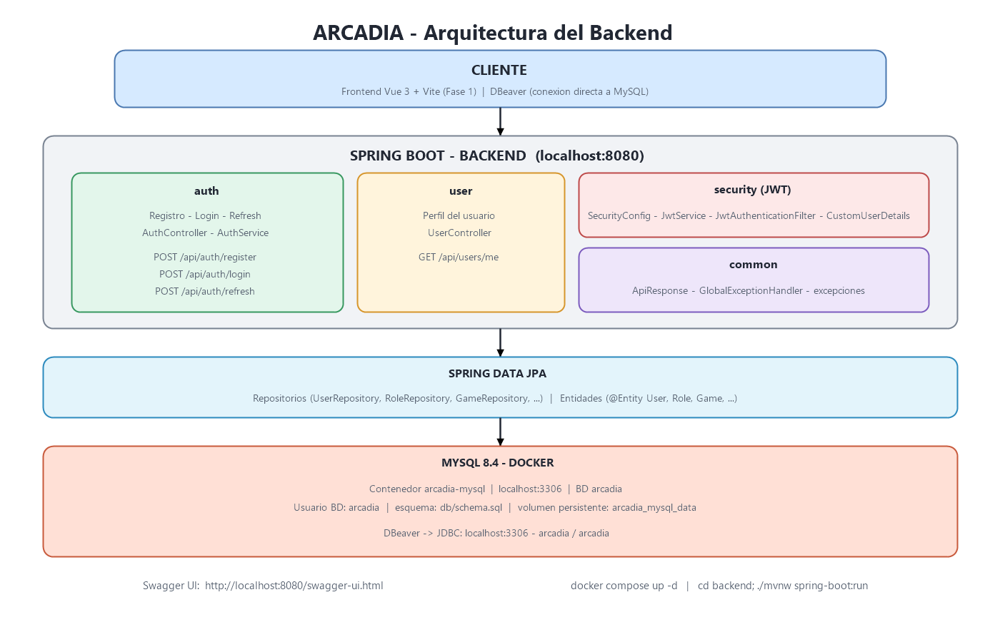

<div align="center">

# 🎮 Arcadia

**Plataforma web Full-Stack para jugar al instante sin descargas**

Juega en el navegador, guarda tu progreso, desbloquea logros y construye tu propia biblioteca personal.

</div>

---

## 📖 ¿Qué es Arcadia?

**Arcadia** es una plataforma web que combina lo mejor de dos mundos:

- 🕹️ **La inmediatez de un Arcade (Friv):** juega directamente en el navegador, sin instalar nada.
- 📚 **La personalización de tu biblioteca (Steam):** progreso centralizado, biblioteca propia, logros y estadísticas por usuario.

El **administrador** es la única figura con permisos para subir, editar y publicar juegos HTML5 en el catálogo.

---

## 🛠️ Stack Tecnológico

| Capa | Tecnología |
| --- | --- |
| **Backend** | Spring Boot (Spring Web, Spring Data JPA, Spring Security, Validation, Lombok) |
| **Base de Datos** | MySQL |
| **Autenticación** | JWT |
| **Frontend** | Vue 3 + Vite (Axios) |
| **Estado Global** | Pinia |
| **Despliegue** | Docker, Cloudinary, Railway, Render, Vercel |

---

## 🚀 Puesta en marcha (desarrollo)

Prerrequisitos: [Docker Desktop](https://www.docker.com/products/docker-desktop/), JDK 21 y Node 20+.

```bash
# 1. Base de datos (MySQL 8.4 en Docker) — aplica db/schema.sql la primera vez
cp .env.example .env   # opcional: ajusta credenciales aquí
docker compose up -d

# 2. Backend (Spring Boot) — http://localhost:8080
cd backend
./mvnw spring-boot:run

# 3. Frontend (Vue 3 + Vite) — http://localhost:5173
cd frontend
npm install
npm run dev
```

- **Swagger/OpenAPI:** http://localhost:8080/swagger-ui.html
- **MySQL (DBeaver/Workbench):** host `localhost:3306`, BD `${MYSQL_DATABASE}`, usuario `${MYSQL_USER}` / contraseña `${MYSQL_PASSWORD}` (ver `.env`).
- Detener la base de datos: `docker compose down` (los datos persisten en el volumen `arcadia_mysql_data`).

---

## ✨ Funcionalidades Clave

### 👥 Módulo de Usuarios *(Estilo Steam)*

- **Autenticación:** Registro, inicio de sesión, verificación de email y recuperación de contraseña.
- **Biblioteca personal (My Library):** añade juegos del catálogo a tu biblioteca propia.
- **Favoritos:** independientes de la biblioteca (puedes marcar favorito sin añadir el juego).
- **Estado y valoración:** marca juegos como *En curso / Completado / Abandonado* y puntúalos de 1 a 5.
- **Reseñas (Reviews):** rating + comentario por juego, como en una plataforma real.
- **Sesiones de juego:** registro de cada sesión para estadísticas (tiempo medio, horas jugadas, sesión más larga).
- **Progreso y Cloud Save:** guardado automático de puntuaciones y nivel vinculado a la cuenta.
- **Sistema de Logros:** insignias con puntos que se envían desde los juegos a la plataforma.
- **Estadísticas:** contador de tiempo total jugado por juego.

### 🎮 Módulo de Catálogo y Reproductor *(Estilo Friv)*

- **Dashboard:** cuadrícula visualmente atractiva con miniaturas de los juegos.
- **Filtros y búsqueda:** por nombre y por géneros (Acción, Puzzle, Carreras, etc.).
- **Galería de capturas:** imágenes del juego (portada y capturas estilo Steam).
- **Más jugados:** ranking calculado agregando `play_sessions` (sin contadores duplicados).
- **Player View:** juego HTML5 ejecutado en un `<iframe>` seguro.
  - Botón de **pantalla completa** (Fullscreen API).
  - Panel lateral con información del juego, capturas, reseñas, logros disponibles/completados y controles.

### 🛡️ Módulo de Administración *(Admin Panel)*

- **Subida de juegos:** formulario con carga de archivos `.zip` (con `index.html` y assets), título, descripción, categoría, miniatura, portada y capturas.
- **Control de versiones:** cada juego tiene `version` y `file_size` registrados.
- **Gestión de juegos:** editar, ocultar y publicar juegos del catálogo.

---

## 🗺️ Roadmap de Desarrollo

```text
FASE 1  ➜  Proyecto base, JWT y Usuarios
FASE 2  ➜  Catálogo
FASE 3  ➜  Subida de Juegos (Admin)
FASE 4  ➜  Biblioteca
FASE 5  ➜  Reproductor (Player)
FASE 6  ➜  Cloud Save
FASE 7  ➜  Logros
FASE 8  ➜  Perfil y Pulido
FASE 9  ➜  Despliegue
```

> El orden está pensado para tener **siempre algo funcionando** de principio a fin.

### 🧱 FASE 1: Proyecto Base, JWT y Usuarios

> **Objetivo:** estructura del proyecto lista, BD conectada y sistema de login/registro funcional.

**Backend (Spring Boot)**
- Crear el proyecto con Spring Initializr (Spring Web, Spring Data JPA, Spring Security, MySQL Driver, Validation, Lombok).
- Configurar la conexión a MySQL en `application.yml`.
- Crear las entidades `@Entity` de `User` y `Role` (`ROLE_USER`, `ROLE_ADMIN`) con relación N:M.
- Seguridad y JWT: `SecurityFilterChain`, `JwtTokenProvider` y `JwtAuthenticationFilter`.
- Tablas de `refresh_tokens`, `password_reset_tokens` y `email_verification_tokens`.
- Endpoints: `POST /api/auth/register` y `POST /api/auth/login`.

**Frontend (Vue 3 + Vite)**
- Crear la app con Vue 3 + Vite, `vue-router` y Axios como cliente HTTP.
- Estado global con Pinia (store de auth con el token del usuario).
- Vistas base: registro, login y layout global con navbar y estado de sesión.
- Guardas de navegación del router (redirect si el usuario no está autenticado).

### 🎮 FASE 2: Catálogo

> **Objetivo:** que el catálogo público muestre los juegos en una cuadrícula estilo Friv.

**Backend (Spring Boot)**
- Endpoint público `GET /api/games` (título, miniatura, portada, categoría y contador de partidas derivado de `play_sessions`).
- Búsqueda por nombre y filtro por categoría (tabla `categories`, no ENUM).

**Frontend (Vue 3 + Vite)**
- **Home estilo Friv:** cuadrícula con tarjetas, búsqueda en tiempo real y filtros por género.

### 🛠️ FASE 3: Subida de Juegos *(Lado Admin)*

> **Objetivo:** permitir al administrador subir `.zip` con juegos HTML5, descomprimirlos y gestionarlos.

**Backend (Spring Boot)**
- Entidad `Game`: título, descripción, `file_path`, `file_size`, `version` (actual), miniatura, portada, categoría y fecha.
- Historial de versiones: tabla `game_versions` (versión, `file_path`, `release_notes`, fecha de subida) para volver a versiones anteriores y mostrar notas de actualización.
- `StorageService`: recibe `.zip` vía `MultipartFile`, lo descomprime en `uploads/games/{game-slug}/`, valida que exista `index.html` y guarda la miniatura en `uploads/thumbnails/`.
- `WebMvcConfigurer` para servir la carpeta `uploads/` como recurso estático.
- Endpoints: `POST /api/admin/games` (requiere `ROLE_ADMIN`), `PUT/DELETE` para editar, ocultar y publicar.
- Galería de capturas: tabla `game_images` (portada + capturas estilo Steam).

**Frontend (Vue 3 + Vite)**
- **AdminDashboard:** formulario de subida (texto, categoría, `.zip`, miniatura y capturas) y gestión de juegos.

### 📚 FASE 4: Biblioteca

> **Objetivo:** biblioteca personal estilo Steam.

**Backend (Spring Boot)**
- Entidad `LibraryItem` (relaciona `User` + `Game` con `added_at`, `last_played_at`, `time_played_seconds`, `status` y `rating`).
- Endpoints:
  - `POST /api/library/add/{gameId}`
  - `DELETE /api/library/remove/{gameId}`
  - `GET /api/library/my-games`
  - `PUT /api/library/{gameId}/status` y `PUT /api/library/{gameId}/rating`

**Frontend (Vue 3 + Vite)**
- **LibraryView:** vista de lista/mosaico con opciones de estado (En curso / Completado / Abandonado), valoración 1-5 y orden por último jugado.
- **Favoritos:** tabla `favorites` independiente de la biblioteca.

### 🕹️ FASE 5: Reproductor *(Player)*

> **Objetivo:** que cualquier usuario pueda entrar a un juego y jugarlo dentro de la web.

**Backend (Spring Boot)**
- Registro de sesiones de juego en `play_sessions` (start, end, duración) para estadísticas y ranking de "Más jugados" (consultas agregadas, sin contador duplicado).

**Frontend (Vue 3 + Vite)**
- **GameView:** `<iframe src="http://localhost:8080/games/nombre-juego/index.html">`.
- Botón de pantalla completa (Fullscreen API).
- Panel lateral: info del juego, capturas, reseñas y logros.
- Botones **"Añadir a mi Biblioteca"** y **"Favorito"**.

### ☁️ FASE 6: Cloud Save

> **Objetivo:** conectar el iframe con la app para guardar partidas automáticamente.

**Intercomunicación Juego ➔ Web (JavaScript `window.postMessage`)**
- Evento `SAVE_DATA`: guardar progreso.
- Evento `LOAD_DATA`: recuperar la partida guardada.

**Backend (Spring Boot)**
- Tabla `saved_games` con JSON (`{ level, coins, weapons }`).
- Endpoints:
  - `POST /api/progress/save`
  - `GET /api/progress/{gameId}`

**Frontend (Vue 3 + Vite)**
- Escuchador de eventos `window.addEventListener('message', ...)` en el reproductor.

### 🏆 FASE 7: Logros

> **Objetivo:** sistema de logros con puntos y logros secretos.

**Backend (Spring Boot)**
- Entidades: `Achievement` (título, descripción, icono, `points`, `hidden`) y `UserAchievement` (fecha de desbloqueo).
- Endpoints:
  - `POST /api/achievements/unlock`
  - `GET /api/achievements/game/{gameId}`

**Frontend (Vue 3 + Vite)**
- Notificación popup de logro desbloqueado (estilo Steam Toast).
- Sección de logros en el perfil del usuario (ocultando los secretos sin desbloquear).

### 🎨 FASE 8: Perfil y Pulido

> **Objetivo:** dar el estilo visual definitivo y la UX profesional.

- **Perfil de usuario:** avatar y estadísticas reales (juegos jugados, horas jugadas, tiempo medio, sesión más larga, total de logros).
- **Reseñas:** `POST /api/reviews` (rating + comentario) por juego.
- **UI/UX:** loaders/skeletons, modales de confirmación y alertas de error estilizadas.
- **Arquitectura limpia:** DTOs, servicios, mappers, validaciones, manejo de excepciones y documentación con Swagger/OpenAPI.

### 🚀 FASE 9: Despliegue

- **Docker Compose:** backend + MySQL para levantar todo el entorno.
- **Backend + BD:** VPS, Railway o Render.
- **Frontend:** Vercel, Netlify o servido junto con Spring Boot.
- **Producción:** variables de entorno, HTTPS y rotación de refresh tokens.

---

## 🎁 Extra: SDK para Juegos *(Arcadia.js)*

Una pequeña librería JavaScript para que los propios juegos se integren con Arcadia sin conocer el protocolo interno:

```js
Arcadia.save({ level: 4, coins: 120 });
Arcadia.unlock("first-boss");
Arcadia.getSave();
Arcadia.getUser();
```

Internamente usa `window.postMessage`, pero para el desarrollador del juego la integración es trivial. Esto convierte a **Arcadia en una plataforma**, no solo en una web que incrusta juegos.

---

## 🏗️ Arquitectura del Backend



Organización por módulos de negocio, con capas `controller → service → repository` dentro de cada uno:

```text
backend
│
├── config          # Configuraciones (Security, WebMvc, CORS)
├── security        # JwtTokenProvider, JwtAuthenticationFilter
├── auth            # Registro, login, refresh tokens, tokens de verificación
├── user            # Perfiles y roles
├── game            # Catálogo y versiones (game_versions)
├── category        # Categorías
├── library         # Biblioteca personal (estado y valoración)
├── achievement     # Logros (points, hidden) y desbloqueos
├── review          # Reseñas con rating
├── favorite        # Favoritos
├── session         # Sesiones de juego y estadísticas
├── storage         # StorageService y subida de .zip
├── sdk             # Protocolo postMessage para los juegos
├── common          # Utilidades y mappers
└── exception       # Manejo global de excepciones (@RestControllerAdvice)
```

Y dentro de cada módulo:

```text
controller  →  service  →  repository  →  entity
            ↘  dto  →  mapper (MapStruct)  ↗
```

**Buenas prácticas previstas:** DTOs en lugar de exponer entidades, validaciones con Bean Validation, manejo global de excepciones, documentación con Swagger/OpenAPI y Docker Compose para levantar el entorno completo.

---

<div align="center">

*Alvaro Castilla  — 2026*

</div>
