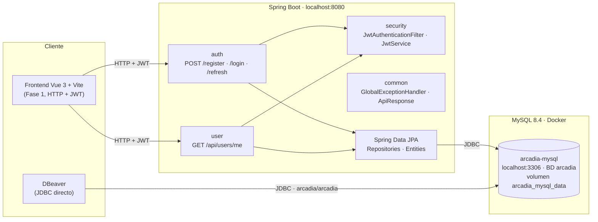

# Arquitectura de Arcadia

> Documento vivo de la arquitectura actual. La imagen `architecture.png` se regenera
> con `generate_architecture.ps1` (PowerShell + System.Drawing, sin dependencias).

## Visión general

```
Cliente                          Backend (Spring Boot)                  Datos
──────────────────────────────   ───────────────────────────────────   ──────────────────────────
Frontend Vue 3 (Fase 1)   ───▶   auth / user / security / common   ─▶   Spring Data JPA   ─▶   MySQL 8.4 (Docker)
DBeaver (JDBC directo)    ──────────────────────────────────────────▶   localhost:3306 · BD arcadia
```

- El **frontend** (futuro, Vue 3 + Vite) se comunica con el backend por **HTTP + JWT**.
- **DBeaver** (y cualquier cliente SQL) se conecta **directamente** a MySQL por el puerto `3306`.
- El backend solo conoce la URL de JDBC `jdbc:mysql://localhost:3306/arcadia`; no sabe que MySQL corre en Docker.

## Módulos actuales del backend

| Módulo | Paquete | Responsabilidad |
| --- | --- | --- |
| `auth` | `com.arcadia.auth` | Registro, login y refresh de tokens (`AuthController`, `AuthService`, DTOs, `UserMapper`) |
| `user` | `com.arcadia.user` | Perfil del usuario autenticado (`GET /api/users/me`) |
| `security` | `com.arcadia.security` | `SecurityConfig`, `JwtService`, `JwtAuthenticationFilter`, `CustomUserDetails` |
| `config` | `com.arcadia.config` | `CorsConfig`, `OpenApiConfig` (Swagger) |
| `common` | `com.arcadia.common` | `ApiResponse`, `ErrorResponse`, `GlobalExceptionHandler`, excepciones y utilidades |
| `entity` | `com.arcadia.entity` | Entidades JPA (User, Role, Game, …) |
| `repository` | `com.arcadia.repository` | Repositorios Spring Data JPA |

## Diagrama (Mermaid)



## Flujo de autenticación (JWT)

1. `POST /api/auth/register` o `POST /api/auth/login` → `AuthService` valida contra BD y devuelve `access` + `refresh`.
2. `JwtAuthenticationFilter` intercepta cada petición, valida el `access` token y rellena el `SecurityContext`.
3. `CustomUserDetails` expone el `User` autenticado a los controladores (`@AuthenticationPrincipal`).
4. `POST /api/auth/refresh` rota el `refresh` token (tabla `refresh_tokens`).

## Infraestructura

- **MySQL 8.4** en Docker Compose (ver `docker-compose.yml` en la raíz).
- Credenciales de desarrollo en `.env` (gitignoreado); plantilla en `.env.example`.
- Esquema de BD: `db/schema.sql` (se aplica automáticamente en el primer arranque del contenedor).
- Datos persistentes en el volumen `arcadia_mysql_data`.

## Cómo regenerar la imagen

```powershell
powershell -ExecutionPolicy Bypass -File docs/generate_architecture.ps1
```


